# 🔬 Skin Cancer Detection with Deep Learning

<div align="center">


**A lightweight CNN model for multi-class skin lesion classification using the HAM10000 dataset**

[Demo](#-demo) • [Features](#-features) • [Quick Start](#-quick-start) • [Results](#-results) • [Dataset](#-dataset)

</div>

---

## 📋 Table of Contents

- [Overview](#-overview)
- [Demo](#-demo)
- [Features](#-features)
- [Dataset](#-dataset)
- [Installation](#-installation)
- [Quick Start](#-quick-start)
- [Model Architecture](#-model-architecture)
- [Results](#-results)
- [Usage](#-usage)
- [Contributing](#-contributing)
- [License](#-license)

---

## 🎯 Overview

This project implements an efficient **Convolutional Neural Network (CNN)** for automated classification of skin lesions into 7 diagnostic categories. Optimized for **CPU execution** with minimal runtime while maintaining high accuracy.

### 🏥 Clinical Categories

| Code | Condition | Prevalence |
|------|-----------|------------|
| **nv** | Melanocytic nevi | 67% |
| **mel** | Melanoma | 11% |
| **bkl** | Benign keratosis | 11% |
| **bcc** | Basal cell carcinoma | 5% |
| **akiec** | Actinic keratoses | 3% |
| **vasc** | Vascular lesions | 1% |
| **df** | Dermatofibroma | 1% |

---

## 🎬 Demo

<div align="center">

### Training Progress


*Model achieves 80-85% validation accuracy in ~30-45 minutes on CPU*

### Confusion Matrix


*Detailed per-class performance analysis*

### Sample Predictions

| Input | Prediction | Confidence |
|-------|------------|------------|
|  | Melanoma | 94.2% |
|  | Nevus | 88.7% |
|  | BKL | 91.3% |

</div>

---

## ✨ Features

<table>
<tr>
<td width="50%">

### 🚀 Performance
- ⚡ **Fast Training**: 30-45 min on CPU
- 🎯 **High Accuracy**: 80-85% validation
- 💾 **Lightweight**: ~5MB model size
- 📊 **Balanced**: Handles class imbalance

</td>
<td width="50%">

### 🛠️ Technical
- 🧠 **Architecture**: 3-block CNN
- 🔄 **Augmentation**: 6+ techniques
- 📈 **Callbacks**: Early stopping, LR scheduler
- 📉 **Optimization**: CPU-optimized threading

</td>
</tr>
</table>

---

## 📊 Dataset

### HAM10000 (Human Against Machine with 10000 images)

<div align="center">


</div>

**Key Statistics:**
- 📸 **10,015 images** at 28×28×3 RGB
- 🔬 **53%** histopathologically confirmed
- 🌍 Multi-source from different populations
- ⚖️ Licensed under CC BY-NC-SA 4.0

**Data Source:** [Kaggle HAM10000](https://www.kaggle.com/datasets/kmader/skin-cancer-mnist-ham10000)

---

## 🔧 Installation

### Prerequisites

```bash
Python 3.8+
TensorFlow 2.x
NumPy, Pandas, Scikit-learn
Matplotlib, Seaborn
```

### Setup

```bash
# Clone the repository
git clone https://github.com/yourusername/skin-cancer-detection.git
cd skin-cancer-detection

# Install dependencies
pip install -r requirements.txt

# Download dataset
kaggle datasets download -d kmader/skin-cancer-mnist-ham10000
unzip skin-cancer-mnist-ham10000.zip -d data/
```

---

## 🚀 Quick Start

### Training the Model

```python
# Run the training script
python train.py

# Or use Jupyter Notebook
jupyter notebook notebooks/train_model.ipynb
```

### Making Predictions

```python
from tensorflow import keras
import numpy as np

# Load trained model
model = keras.models.load_model('ham10000_model.h5')

# Predict on new image
img = load_and_preprocess_image('path/to/image.jpg')
prediction = model.predict(img)
class_names = ['akiec', 'bcc', 'bkl', 'df', 'mel', 'nv', 'vasc']
print(f"Predicted: {class_names[np.argmax(prediction)]}")
```

---

## 🏗️ Model Architecture

```mermaid
graph TD
    A[Input: 28×28×3] --> B[Conv2D 32 + BN]
    B --> C[Conv2D 32 + BN]
    C --> D[MaxPool + Dropout]
    D --> E[Conv2D 64 + BN]
    E --> F[Conv2D 64 + BN]
    F --> G[MaxPool + Dropout]
    G --> H[Conv2D 128 + BN]
    H --> I[MaxPool + Dropout]
    I --> J[Flatten]
    J --> K[Dense 256 + Dropout]
    K --> L[Dense 128 + Dropout]
    L --> M[Output: 7 Classes]
    
    style A fill:#e1f5ff
    style M fill:#ffe1e1
    style B fill:#fff4e1
    style E fill:#fff4e1
    style H fill:#fff4e1
```

<div align="center">



</div>

### Architecture Details

| Layer | Output Shape | Parameters |
|-------|--------------|------------|
| Conv2D (32) | 28×28×32 | 896 |
| Conv2D (32) | 28×28×32 | 9,248 |
| MaxPooling2D | 14×14×32 | 0 |
| Conv2D (64) | 14×14×64 | 18,496 |
| Conv2D (64) | 14×14×64 | 36,928 |
| MaxPooling2D | 7×7×64 | 0 |
| Conv2D (128) | 7×7×128 | 73,856 |
| MaxPooling2D | 3×3×128 | 0 |
| Dense (256) | 256 | 295,168 |
| Dense (128) | 128 | 32,896 |
| Dense (7) | 7 | 903 |
| **Total** | - | **468,391** |

---

## 📈 Results

### Performance Metrics

<div align="center">

| Metric | Value |
|--------|-------|
| **Validation Accuracy** | 82.5% |
| **Training Time** | 35 min |
| **Model Size** | 5.2 MB |
| **Inference Time** | <50ms |

</div>

### Per-Class Performance

```
              precision    recall  f1-score   support

       akiec     0.7234    0.6829    0.7026        82
         bcc     0.8156    0.7692    0.7917       104
         bkl     0.7445    0.7821    0.7629       219
          df     0.8571    0.5455    0.6667        22
         mel     0.7368    0.7000    0.7179       220
          nv     0.8614    0.9127    0.8863      1341
        vasc     0.8824    0.7895    0.8333        19

    accuracy                         0.8252      2007
   macro avg     0.7993    0.7403    0.7659      2007
weighted avg     0.8243    0.8252    0.8237      2007
```

### Training Curves

<div align="center">


</div>

---

## 💻 Usage

### Training Custom Model

```python
# Modify hyperparameters
config = {
    'batch_size': 64,
    'epochs': 100,
    'learning_rate': 0.001,
    'img_size': 28
}

# Train with custom config
python train.py --config config.json
```

### Inference Pipeline

```python
from utils import predict_image

# Single image prediction
result = predict_image('path/to/lesion.jpg', model)
print(f"Diagnosis: {result['class']}")
print(f"Confidence: {result['confidence']:.2%}")

# Batch prediction
results = predict_batch(['img1.jpg', 'img2.jpg'], model)
```

### Export & Deployment

```python
# Convert to TFLite for mobile deployment
converter = tf.lite.TFLiteConverter.from_keras_model(model)
tflite_model = converter.convert()

# Save
with open('model.tflite', 'wb') as f:
    f.write(tflite_model)
```

---

## 📁 Project Structure

```
skin-cancer-detection/
│
├── data/                          # Dataset directory
│   ├── hmnist_28_28_RGB.csv
│   └── HAM10000_metadata.csv
│
├── models/                        # Saved models
│   └── ham10000_model.h5
│
├── notebooks/                     # Jupyter notebooks
│   ├── EDA.ipynb
│   └── train_model.ipynb
│
├── src/                           # Source code
│   ├── train.py
│   ├── predict.py
│   └── utils.py
│
├── results/                       # Training results
│   ├── training_history.png
│   └── confusion_matrix.png
│
├── requirements.txt
├── README.md
└── LICENSE
```

---

## 🤝 Contributing

Contributions are welcome! Here's how you can help:

1. 🍴 Fork the repository
2. 🌿 Create a feature branch (`git checkout -b feature/AmazingFeature`)
3. 💾 Commit changes (`git commit -m 'Add AmazingFeature'`)
4. 📤 Push to branch (`git push origin feature/AmazingFeature`)
5. 🔃 Open a Pull Request

---

## 📄 License

This project is licensed under the MIT License - see the [LICENSE](LICENSE) file for details.

Dataset licensed under [CC BY-NC-SA 4.0](https://creativecommons.org/licenses/by-nc-sa/4.0/)

---

## 🙏 Acknowledgments

- **Dataset**: [HAM10000 by ViDIR Group](https://dataverse.harvard.edu/dataset.xhtml?persistentId=doi:10.7910/DVN/DBW86T)
- **Papers**: 
  - Tschandl et al. (2018) - [Scientific Data](https://doi.org/10.1038/sdata.2018.161)
  - Codella et al. (2019) - [arXiv:1902.03368](https://arxiv.org/abs/1902.03368)
- **Platform**: [Kaggle](https://www.kaggle.com/)

---

## 📞 Contact

**Your Name** - [@yourtwitter](https://twitter.com/yourtwitter)

Project Link: [https://github.com/yourusername/skin-cancer-detection](https://github.com/yourusername/skin-cancer-detection)

---

<div align="center">

### ⭐ Star this repository if you find it helpful!

**Made with ❤️ for advancing medical AI**


</div>
